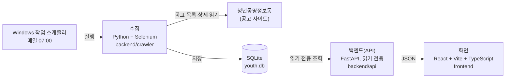
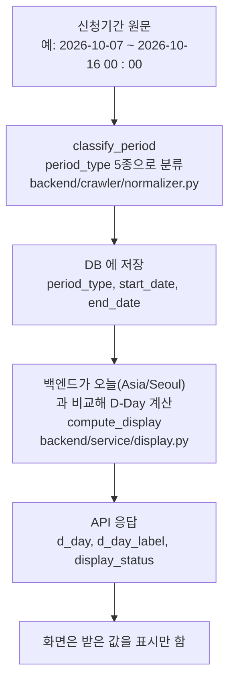
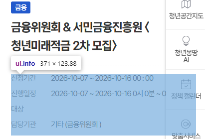

# 서울 청년정책 마감 D-Day 알리미

청년몽땅정보통의 청년 지원 공고를 매일 수집해, **마감까지 며칠 남았는지(D-Day)**, 신규·변경·내려간 공고, 월별 마감 달력을 보여 주는 웹서비스입니다.

- 발표 자료: `TODO(확인 필요)`: 발표 자료 링크가 저장소에 없음
- 시연 영상: [웹크롤링 시연영상.mp4](docs/images/%EC%9B%B9%ED%81%AC%EB%A1%A4%EB%A7%81%20%EC%8B%9C%EC%97%B0%EC%98%81%EC%83%81.mp4) (GitHub 에서는 README 안에서 재생되지 않고, 링크를 누르면 파일 화면이 열립니다)


*2026-10-04 07:00 수집분 기준 화면입니다(화면 위쪽의 날짜·마지막 수집 시각). 이미지 속 공고 내용의 출처는 청년몽땅정보통의 공개 페이지입니다.*

---

## 1. 개요

**문제.** 공고마다 신청기간이 문장으로 적혀 있고(예: `2026-09-29 ~ 2026-10-09 00 : 00`, `상시 [ 선착순 마감 ]`), 상시·마감일 미정 공고도 섞여 있습니다. 이 문장에서 "오늘 기준으로 며칠 남았는지"와 "어제와 달라진 점(신규, 내려감)"을 매일 직접 찾아야 합니다. 이것이 이 프로젝트를 시작한 동기입니다.

**목표.** 공고를 매일 수집해 신청기간을 날짜로 바꿔 저장하고, 마감 D-Day 순서로 보여 주며, 변경 이력과 월별 마감 달력을 함께 제공합니다.

| 항목 | 내용 |
|---|---|
| 기간 | 2026-10-01 ~ 2026-10-07 |
| 역할 | 1인 풀스택, 구현은 AI 코딩 도구 Claude Code 의 도움을 받았습니다(아래 "AI 도구 사용 고지") |
| 기술 스택 | 수집: Python 3.12 + Selenium / 저장: SQLite / 백엔드: FastAPI(읽기 전용 API) / 화면: React 19 + Vite 8 + TypeScript 6.0 / 테스트: pytest, Vitest |
| 지원 범위 | Windows(개발·운영 환경), Chrome 브라우저 필요, **배포 없음(내 PC 에서만 실행)**.|

AI(LLM)는 서비스 기능에 쓰지 않았습니다. 모든 판정(D-Day, 분류, 변경 감지)은 정해진 규칙으로 계산합니다.

용어: **백엔드**는 화면이 요청하면 DB 에서 값을 읽어 돌려주는 부분이고, **API** 는 그 요청과 응답의 약속(주소와 형식)입니다. **D-Day** 는 마감일까지 남은 날짜입니다.

## 2. 서비스 구조



- **수집**은 사이트에 접속 대기열이 있어 일반 요청으로는 목록이 나오지 않아 Selenium 으로 Chrome 을 띄워 읽습니다.
- **백엔드는 DB 에 쓰지 않습니다.** 요청마다 읽기 전용으로 열고, 쓰기 기능이 없습니다(GET 6개).
- **화면은 표시만 합니다.** D-Day 같은 값은 백엔드가 계산해 주고, 화면은 그 값을 그대로 보여 줍니다.

## 3. 데이터 흐름

사이트의 신청기간 원문이 화면의 "D-3" 이 되기까지의 흐름입니다.





| period_type | 의미 | 화면에서 |
|---|---|---|
| `dated` | 시작일과 마감일이 모두 있음 | 마감 D-Day, 시작일이 미래면 "시작 D-n"(모집예정) |
| `end_only` | 시작일 없이 "~ 마감일" | `dated` 처럼 마감 D-Day |
| `open` | 마감일 미정 | "마감일 미정" |
| `always` | "상시" | "상시" (분야가 없으면 기타 탭) |
| `unknown` | 해석 불가 | "확인 필요" |

- D-Day 는 `마감일 − 오늘`(Asia/Seoul)입니다. **날짜만 비교하고 시각(예: `00 : 00`)은 무시**합니다.
- 상세 페이지의 **진행일정**(행사 날짜)은 마감일로 쓰지 않고 표시용으로만 저장합니다.
- 사이트가 "모집중"이라고 해도 시작일이 미래면 날짜를 우선해 "모집예정"으로 표시합니다.
- 화면은 브라우저 시계로 D-Day 를 계산하지 않습니다(백엔드가 준 `d_day_label` 을 그대로 사용).
- 자세한 분류 규칙과 예시: [docs/period_classification.md](docs/period_classification.md)

## 4. 실제 구현 화면

**마감 임박 탭** (2026-10-04 07:00 수집분): 오늘 마감 공고(D-Day 카드), 곧 마감 목록, 분야 칩, 월별 마감 달력(점은 마감 건수에 따라 1–5건 / 6–15건 / 16건 이상 3단계), 최근 7일 변경 요약.


**공고 상세 패널**: 기관, 분야, 신청기간, 사이트가 표시한 상태, "신청 페이지 열기", "구글 캘린더에 추가", 변경 이력을 보여 줍니다. 이 캡처의 기준 날짜는 이미지에서 알 수 없어 `TODO(확인 필요)`: 기록 없음.


시연 영상: [웹크롤링 시연영상.mp4](docs/images/%EC%9B%B9%ED%81%AC%EB%A1%A4%EB%A7%81%20%EC%8B%9C%EC%97%B0%EC%98%81%EC%83%81.mp4) 

## 5. 핵심 기능

코드와 실행 결과로 확인된 것만 적었습니다.

| 기능 | 내용 | 확인 근거 |
|---|---|---|
| 신청기간 분류 | 신청기간 원문을 `dated` / `end_only` / `open` / `always` / `unknown` 5종으로 분류하고 시작일·마감일을 만듭니다 | `normalizer.py`, 테스트 |
| D-Day 계산·정렬 | 모집중(마감 임박 순) → 모집예정(시작 D-n) → 마감일 미정 → 상시 → 상시-기타 → 확인 필요 순으로 정렬. 마감이 지난 공고는 목록에서 제외 | `display.py`, 테스트 |
| 일일 수집 정책 | 목록은 전체를 읽고 상세는 정책 대상만 받습니다(2026-10-06 실행: 상세 404건 요청, 정책상 제외 1,068건) | [docs/daily_crawl_policy.md](docs/daily_crawl_policy.md), 실행 로그 |
| 안전장치 | 목록을 끝까지 읽은 실행에서만 사라진 공고를 비활성 처리, 직전 활성의 50% 미만이면 비활성 처리 안 함, 상세 연속 10건 실패 시 중단 | 코드, 테스트, 로그(50% 검사는 매 실행 통과) |
| 변경 감지 | 변경 이벤트를 DB 에 기록하고 화면에 배지·최근 변경으로 표시 (아래 표) | `db.py`, 테스트 |
| 읽기 전용 API | GET 6개: `health`, `meta`, `programs`, `calendar`, `programs/{source_id}`, `changes` | [docs/api_reference.md](docs/api_reference.md) |
| 화면 | 탭 4개(마감 임박·상시·기타·최근 변경), 분야 칩, 검색, 월별 마감 달력(날짜를 누르면 그날 마감 목록), 최근 7일 변경 요약, 상세 패널 | `frontend/`, Vitest |
| 구글 캘린더에 추가 | 마감일이 오늘 이후인 모집중·모집예정 공고에만 링크를 보여 주며, 누르면 구글 캘린더 일정 추가 화면이 열립니다(파일 내보내기 없음). 추가한 시점의 마감일 기준이고 이후 변경은 자동 반영되지 않습니다 | `calendar_exportable` 필드, 코드. 모바일 실기기 동작은 확인하지 않음 |

### 변경 감지: 지원하는 것과 실제로 관찰한 것

기준: 2026-10-06 07:13 수집 후 DB 의 변경 이벤트 73건입니다.

| 변경 종류 | 지원 | 실제 관찰 |
|---|---|---|
| 목록에서 내려감(`deactivated`) | 예 | **68건**: 마감일이 지나 내려감(`expired`) 55건, 마감일 전에 내려감(`early`) 13건 |
| 사이트 표기(모집상태) 변경(`status_changed`) | 예 | **5건** |
| 신규(NEW) | 예 (이벤트 행이 아니라 처음 본 날짜로 계산) | 2026-10-04 화면에서 최근 7일 신규 33건 |
| 마감 연장(`extended`) | 예 | **0건**: 단위 테스트로만 확인 |
| 마감 단축(`shortened`) | 예 | **0건**: 단위 테스트로만 확인 |
| 신청기간 변경(`period_changed`) | 예 | **0건**: 단위 테스트로만 확인 |
| 다시 게시됨(`reactivated`) | 예 | **0건**: 단위 테스트로만 확인 |

`expired` 와 `early` 는 사이트가 알려 준 이유가 **아닙니다.** 공고가 목록에서 사라진 것을 확인한 날짜와 공고의 마감일을 비교해 **계산한 값**입니다(마감일이 있고 그 날짜가 확인한 날보다 이르면 `expired`, 그 외는 `early`).

## 6. 자동 수집과 운영

Windows 작업 스케줄러가 매일 07:00 에 수집을 실행합니다(설정은 2026-10-06 에 읽기 전용으로 조회해 확인).

| 항목 | 값 |
|---|---|
| 작업 이름 | `SeoulYouthDaily` |
| 실행 시각 | 매일 07:00 |
| 실행 제한 시간 | 2시간 |
| 동작 | conda 환경의 `python.exe` 를 직접 호출: `-m backend.crawler.crawl --daily --headless` (`--headless` 는 브라우저 창 없이 실행) |
| 시작 위치 | 프로젝트 루트 |

실행 결과(각 날짜의 수집 로그 기준):

| 실행일 | 소요 | 상세 성공 / 실패 | WARNING·ERROR | 활성 공고 (전 → 후) | 새로 비활성 |
|---|---|---|---|---|---|
| 2026-10-04 | 877.0초 | 432 / 0 | 0건 | 1,502 → 1,500 | 2건 |
| 2026-10-05 | 855.3초 | 427 / 0 | 0건 | 1,500 → 1,495 | 5건 |
| 2026-10-06 | 790.0초 | 404 / 0 | 0건 | 1,495 → 1,472 | 24건 |

작업 스케줄러 조회(2026-10-06): 마지막 실행 07:00:01, 작업 결과 0, 놓친 실행 0회.

DB 현황(2026-10-06 07:13 수집 후, 읽기 전용 복사본으로 조회): 공고 1,556건 중 활성 1,472건(상시 1,068건, 기간이 있는 공고 `dated` 404건), 비활성 84건.

확인하지 못했거나 아직 동작한 적 없는 것:
- 작업 스케줄러의 "놓친 실행을 가능한 한 빨리 시작" 옵션은 **설정만 했고 동작을 확인하지 못했습니다**(놓친 실행이 한 번도 없었음).
- **상시 공고 7일 갱신은 구현과 테스트만 했고 실제로 발동한 적이 없습니다.** 로그에서 "상시 갱신"은 모두 0건이며, 첫 발동은 2026-10-09~10-10 쯤으로 **예상**합니다(확인하지 않음).
- 자동 실행 기록은 3일(10-04~10-06)뿐입니다.

자세한 내용: [docs/scheduler.md](docs/scheduler.md), [docs/daily_crawl_policy.md](docs/daily_crawl_policy.md)

## 7. 검증 결과

2026-10-06 에 직접 실행한 결과입니다(코드는 마지막 확인 이후 바뀌지 않았고, 이후 커밋은 이미지 추가뿐).

| 도구 | 결과 | 소요 시간 |
|---|---|---|
| 백엔드 `pytest -q` | **440 passed**, 1 warning (파일 12개. 경고는 FastAPI 테스트 도구의 `httpx2` 설치 안내) | 79.72초 |
| 화면 `npm test` (Vitest) | **62 passed** (테스트 파일 5개) | 5.06초 |
| 화면 `npm run lint` (oxlint) | 경고 2건(`frontend/src/api/hooks.ts`), 종료 코드 0 | |

- 같은 날 처음 실행했을 때는 pytest 88.20초, Vitest 29.37초였습니다. **소요 시간은 실행마다 달랐습니다.**
- 테스트는 `backend/crawler/samples/` 의 HTML 파일만 읽고 사이트에 접속하지 않습니다.
- 모바일 실기기, 스크린리더 실사용, 글자 대비의 도구 측정은 하지 않았습니다.

## 8. Known Issues

전체 목록(20개)은 [docs/limitations.md](docs/limitations.md) 에 있고, 중요한 5개만 적습니다.

1. **PC 가 켜져 있고 로그인된 상태여야 자동 수집이 실행됩니다.** 꺼져 있던 날은 수집 공백이 생길 수 있습니다.
2. **사이트 구조가 바뀌면 수집이 깨질 수 있습니다.** 목록이 0건이면 DB 를 건드리지 않고 종료 코드 2 로 끝납니다.
3. **상시 공고가 마감일 전에 내려가는 원인은 확정하지 못했습니다.** 개발용 복사본 2026-10-04 기준 비활성 상시 11건은 모두 `source_id` 가 64727 이하이고 활성 상시 1,068건은 모두 64782 이상이라 오래된 것부터 사라진 것으로 보이지만, 이는 "ID 가 등록 순서를 반영한다"는 **검증하지 않은 가정** 위의 **가설**입니다.
4. **활성 상시 공고 중에는 진행일정이 이미 끝난 것이 많습니다.** 복사본 2026-10-04 기준 활성 상시 1,068건 중 진행일정의 마지막 날짜가 2026-10-04 이전인 것이 560건입니다(날짜를 읽지 못한 354건 제외). 화면에서 어떻게 다룰지는 정하지 않았습니다.
5. **마감 연장·단축·신청기간 변경·다시 게시됨 이벤트는 실제로 한 번도 발생하지 않았습니다.** 단위 테스트로만 확인했고, 관찰 기간은 2026-10-02~10-06 로 짧습니다.

## 9. 문제 해결 경험 4건

### ① 자동 수집 실행 방식 변경
- **문제:** 작업 스케줄러에 `run_daily.bat` 을 연결했더니 작업 결과 코드가 `3221225477`(0xC0000005)로 나왔습니다. Windows 이벤트 로그에서 종료된 프로그램은 파이썬이 아니라 `cmd.exe` 였고, 같은 `.bat` 은 일반 터미널에서 정상 동작했으며, 수집 로그에는 이 시도의 실행 기록이 남지 않았습니다.
- **원인:** 확정하지 못했습니다(원인 미확정).
- **해결:** 작업 동작을 `.bat` 대신 conda 환경의 `python.exe` 직접 호출로 바꿨습니다. `.bat` 은 수동 실행용으로만 남겼습니다.
- **확인한 값:** 바꾼 직후 수동 시작에서 작업 결과 0, 소요 137.4초. 이후 2026-10-04, 10-05, 10-06 07:00 자동 실행이 3회 연속 정상 종료했습니다(상세 실패 0건, WARNING·ERROR 0건).
- **근거:** [docs/devlog.md](docs/devlog.md) 6번·12번, [docs/scheduler.md](docs/scheduler.md)

### ② 사라진 공고를 "마감 지남"과 "마감 전"으로 나눠 기록
- **문제:** 공고가 목록에서 사라져도 이력이 남지 않았고, 마감이 지나서 사라진 것인지 마감 전에 내려간 것인지 구분할 수 없었습니다.
- **원인:** 변경 이력을 저장하는 곳이 없었습니다.
- **해결:** 변경 이벤트 테이블(`program_changes`)을 만들고, 목록에서 사라질 때 마감일과 사라진 시점을 비교해 `expired`/`early` 사유를 계산해 기록합니다. 같은 값으로 다시 실행하면 이벤트가 새로 생기지 않게 했습니다(커밋 `215e75c`).
- **확인한 값(2026-10-02 → 10-03 실데이터):** 내려간 공고 37건 = 마감 지남 24건 + 마감 전 13건. 마감 지남 24건은 10-02 에 D-Day 였던 24건과 정확히 일치했고, 같은 날 재실행에서 변경 이벤트는 0건이었습니다.
- **근거:** [docs/devlog.md](docs/devlog.md) 3번·12번

### ③ 화면 초안의 숫자와 실데이터 차이
- **문제:** 화면 시안에 "오늘 마감 24건, 마감일 미정 4건"이 들어 있었는데, 10-03 수집 뒤 실데이터는 오늘 마감 2건, 마감일 미정 0건이었습니다. 10월 날짜별 마감 건수가 1~28건이라 달력의 점 하나(있다/없다)로는 건수 차이를 구분할 수 없었습니다.
- **원인:** 시안의 숫자가 10-02 수집분 기준이었고, 10-03 은 토요일이었습니다.
- **해결:** "오늘 마감"과 "마감일 미정" 구역은 0건이면 숨기고, 달력 점을 건수에 따라 3단계로 바꿨습니다(기준값은 `frontend/src/lib/calendar.ts` 한 곳, 날짜 버튼의 `aria-label` 에도 건수를 넣음).
- **확인한 값:** 개발용 복사본(2026-10-03)에서 화면의 오늘 마감 2건, 마감일 미정 구역 없음.
- **근거:** [docs/devlog.md](docs/devlog.md) 8번

### ④ 화면의 API 우회 제거
- **문제:** 첫 화면 구현이 API 에 없는 정보를 우회해서 만들었습니다. 분야 칩은 전체 목록을 200건씩 여러 번 읽어 분야 값을 모았고, 마감일 미정은 목록 끝 50건을 훑어 찾았으며, "마감일 전에 내려감"과 "게시 종료"를 구분하지 못했습니다.
- **원인:** API 가 분야 목록, 그룹별 건수, 변경 항목의 마감일을 주지 않았습니다.
- **해결:** API 에 분야 목록(`categories`), 그룹 필터와 그룹별 건수(`group`, `group_counts`), 변경 항목의 `end_date`·`period_type` 을 추가하고 화면의 우회 코드를 걷어냈습니다(커밋 `1183ce8`, `3444cb1`).
- **확인한 값(2026-10-03):** 개발용 복사본으로 브라우저에서 분야 칩 14개, 최근 변경의 내려감 37건 중 "마감됨" 24건·"게시 종료" 13건. 당시 `pytest` 427 passed, `npm test` 46 passed(현재는 440, 62).
- **근거:** [docs/devlog.md](docs/devlog.md) 10번

## 10. Repository Structure

```text
.
├─ backend/
│  ├─ crawler/     수집: Selenium, 파싱, 신청기간 분류, DB 저장
│  ├─ service/     표시 규칙(D-Day·그룹·정렬·배지) 순수 함수
│  ├─ api/         읽기 전용 FastAPI
│  ├─ app/         비어 있음 (정리 예정)
│  └─ data/        youth.db 생성 위치 (git 에 올리지 않음)
├─ frontend/       React 화면 (Vite + TypeScript, Vitest)
├─ tests/          pytest
├─ notebooks/      탐색용 노트북
├─ scripts/        수동 실행용 배치 파일
└─ docs/           개발 일지, 보조 문서, 이미지
```

폴더별 역할과 파일 수: [docs/repository_structure.md](docs/repository_structure.md)

## 11. 관련 문서

| 문서 | 내용 |
|---|---|
| [docs/setup_and_run.md](docs/setup_and_run.md) | 설치와 실행 명령, 개발 환경 버전 |
| [docs/api_reference.md](docs/api_reference.md) | API 6개와 쿼리 |
| [docs/period_classification.md](docs/period_classification.md) | 신청기간 5종 분류와 예시 |
| [docs/daily_crawl_policy.md](docs/daily_crawl_policy.md) | 일일 수집 대상, 안전장치, 종료 코드 |
| [docs/scheduler.md](docs/scheduler.md) | 작업 스케줄러 설정과 결과 |
| [docs/limitations.md](docs/limitations.md) | 알려진 한계 전체 |
| [docs/repository_structure.md](docs/repository_structure.md) | 저장소 구조 |
| [docs/devlog.md](docs/devlog.md) | 개발 일지(문제 → 한 일 → 결과 → 남은 의문) |
| [CLAUDE.md](CLAUDE.md) | 개발 규칙, 사이트 구조, DB·API 규칙 |
| [frontend/README.md](frontend/README.md) | 화면 구조와 규칙 |

## 12. 얻은 경험

개발 일지에 기록된 일에서 정리했습니다.

- **화면 설계에 쓴 숫자는 수집한 날에 따라 달라집니다.** 시안의 "오늘 마감 24건"이 실데이터에서는 2건이었습니다. 기준 날짜를 같이 적고, 건수가 0일 때의 화면을 미리 정해 둬야 했습니다.
- **화면이 API 에 없는 값을 우회해 만들면 숫자가 어긋나기 쉽습니다.** API 에 필드를 추가하고 같은 판정 함수를 쓰게 해서 달력 건수와 목록 건수가 같다는 것을 테스트로 고정했습니다.
- **원인을 못 찾은 문제는 우회하되 "원인 미확정"으로 남깁니다.** `.bat` 오류가 그 예입니다.
- **확인한 사실과 가설을 구분해 적었습니다.** 예를 들어 상시 공고가 사라지는 이유에 대해 세웠던 가설 하나는 DB 로 확인해 틀린 것으로 드러나 삭제했습니다([devlog 12번](docs/devlog.md)).

## 13. 향후 방향

개발 일지 15번의 "앞으로 할 일"을 기준으로 적었습니다.

- 자동 수집 결과를 며칠 더 연속으로 확인하고, 상시 공고 7일 갱신이 처음 동작하는 날(예상 10-09~10-10)의 결과를 확인합니다.
- 상시 공고가 사라지는 이유에 대한 가설과 "평일에 마감이 몰린다"는 가설을 며칠 더 수집해 검증합니다.
- 진행일정이 이미 끝난 상시 공고를 화면에서 어떻게 다룰지(그대로 표시 / 라벨 / 정렬·분리) 결정합니다.
- 구글 캘린더 추가 링크를 모바일 실기기에서 확인하고, 접근성(스크린리더, 글자 대비)을 도구로 측정합니다.
- 연장·단축·기간 변경·다시 게시됨 이벤트가 실제 데이터에서 나오면 화면 문구를 확인합니다.
- 저장소 정리: 비어 있는 `backend/app/` 정리, `requirements.txt` 버전 고정 여부 결정.
- 라이선스: `TODO(확인 필요)`: LICENSE 파일이 없고 어떤 라이선스를 쓸지 정하지 않았습니다.

---

## AI 도구 사용 고지

이 서비스의 기능에는 AI(LLM)를 사용하지 않습니다. 개발 과정에서는 AI 코딩 도구 **Claude Code** 를 사용했습니다. 설계와 검수는 개발자가 했고, AI 는 구현을 도왔습니다. 화면 시안(카드형·리스트+상세형·타임라인+캘린더형 3종과 이를 합친 시안)은 AI(Claude)가 만든 렌더링 시안을 개발자가 비교·선택했고, React 구현은 Claude Code 로 했습니다.
