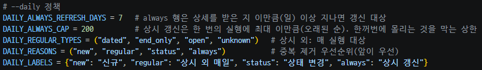
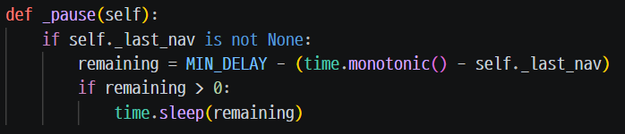

# 일일 수집 정책 (--daily)

매일 목록 전체(약 1,500건)의 상세 페이지를 모두 받으면 사이트에 부담이 크고 오래 걸립니다. 그래서 `--daily` 는 **목록은 전체를 읽고, 상세 페이지는 정책 대상만** 받습니다. 근거는 `backend/crawler/crawl.py` 와 [CLAUDE.md](../CLAUDE.md)입니다.

## 상세를 받는 대상

대상은 중복을 제거하며, (a) → (b) → (c) → (d) 순서로 처음 해당하는 구분 하나로만 셉니다(`plan_daily_targets`, DB 접근이 없는 순수 함수).

| 구분 | 대상 |
|---|---|
| (a) 신규 | DB 에 없거나, 상세를 받은 적 없는(`detail_fetched_at` 이 비어 있는) 행 |
| (b) 상시 외 매일 | 활성 행 중 `period_type` 이 `dated` / `end_only` / `open` / `unknown` 인 것 (매 실행) |
| (c) 상태 변경 | 이번 목록의 모집상태가 DB 에 저장된 상태와 다른 행 |
| (d) 상시 갱신 | 활성 `always` 행 중 상세를 받은 지 **7일 이상**(`DAILY_ALWAYS_REFRESH_DAYS = 7`) 지난 행. 오래된 순으로 **한 번의 실행에 최대 200건**(`DAILY_ALWAYS_CAP = 200`) |

- 비활성 행(목록에 없음)은 받지 않습니다.
- 오늘(서울 날짜) 이미 상세를 받은 행은 대상이어도 다시 요청하지 않습니다. 판정에는 `detail_fetched_at` 만 씁니다(`last_seen_at` 은 목록만 본 실행도 갱신해서 쓰지 않음).
- 대상 판정은 이번 실행의 저장 전에 합니다(DB 의 이전 값과 이번 목록 상태를 비교해야 하므로).
- 상세를 받은 시각이 7일 이상 지난 상시 행이 200건을 넘으면 오래된 것부터 200건만 받습니다. 한꺼번에 몰리는 것을 막는 상한입니다.

### 현재까지 실제로 확인된 것과 아닌 것

- (a), (b)는 매일 실행에서 동작했습니다. 예: 2026-10-06 07:00 실행은 신규 1건 / 상시 외 매일 403건 / 상태 변경 0건 / 상시 갱신 0건 → 대상 404건이었습니다(실제 상세 요청 404건, 정책상 제외 1,068건).
- (c)는 `--daily` 실행 로그 6개(2026-10-03 3회, 10-04, 10-05, 10-06) 모두 0건이라 **실제로 발동한 적이 없습니다**(구현과 테스트만 있음).
- **(d) 상시 7일 갱신은 구현과 테스트만 했고 실제로 발동한 적이 없습니다.** 위 로그 6개의 "상시 갱신"은 모두 0건입니다. 활성 상시 행의 상세 수신일은 가장 이른 것이 2026-10-02(1,067건)이므로, 날짜 차이가 7일이 되는 2026-10-09 이후 첫 실행부터 대상이 생길 것으로 **예상**합니다(예상일 10-09~10-10, 실행 결과로 확인하지 않음).

## 안전장치

| 장치 | 동작 |
|---|---|
| 완전 수집일 때만 비활성 처리 | 목록을 끝까지 정상으로 읽은 실행에서만 `deactivate_unseen` 을 호출해 목록에서 사라진 공고를 `is_active=0` 으로 바꿉니다. `--max-pages`·`--detail-limit` 을 쓴 부분 실행이나 중단된 실행에서는 호출하지 않습니다. 상세가 정책으로 일부만 대상이어도 목록을 끝까지 읽었으면 완료된 수집으로 봅니다. |
| 50% 검사 | 이번 수집 건수가 직전 활성 공고 수의 **50% 미만**이면 비활성 처리를 하지 않고 경고합니다. 직전 활성이 없는 첫 전체 실행은 검사를 생략합니다. 2026-10-06 실행 로그: 수집 1,472건 / 직전 활성 1,495건 = 98%, 통과. |
| 상세 연속 실패 중단 | 상세 요청(수신 실패 또는 파싱 실패)이 **연속 10건**(`MAX_CONSECUTIVE_DETAIL_FAILURES`) 실패하면 수집을 멈춥니다. 종료 코드 4, 비활성 처리를 하지 않습니다. 성공하면 카운터가 0으로 돌아갑니다. |
| 요청 간 대기 | 페이지 이동 사이에 최소 1초(`MIN_DELAY`)를 둡니다. |
| 재시도 | 타임아웃이 나면 최대 2회 재시도하고, 그래도 안 되면 스크린샷을 남깁니다. |

50% 검사는 매 실행에서 계산되어 통과했고(2026-10-03~10-06 로그 6개 모두 98~100%), 검사에 걸려 비활성 처리를 건너뛴 적은 없습니다. 상세 연속 실패 중단은 구현과 테스트(가짜 수집기 사용)로 확인했고, **실제 운영에서 발동한 적은 없습니다**(`--daily` 로그 6개 모두 상세 실패 0건, 2026-10-06 기준).

## 실행 옵션

| 인자 | 설명 |
|---|---|
| `--daily` | 일일 수집. `--reclassify`, `--no-detail` 과 함께 쓸 수 없음 |
| `--daily-plan` | 사이트에 접속하지 않고 저장된 DB 만 읽기 전용으로 읽어 (a)(b)(d) 대상 건수를 출력(c 는 목록을 읽어야 알 수 있어 "실행 시 결정"). `--daily`, `--reclassify` 와 함께 쓸 수 없음 |
| `--headless` | 브라우저 창 없이 실행 |
| `--max-pages N`, `--detail-limit N` | 부분 실행(비활성 처리를 하지 않음) |
| `--reclassify` | 사이트에 접속하지 않고 신청기간 분류를 다시 계산 |
| `--no-detail` | 상세 방문 생략 |

## 종료 코드

0 정상(부분 실행 포함) / 1 목록을 끝까지 읽지 못함(일부 페이지 실패 또는 상한 도달) / 2 목록 0건·제외 후 대상 0건(DB 변경 없음), 또는 `--reclassify`·`--daily-plan` 에서 DB 파일이 없거나 `--daily-plan` 의 DB 스키마가 오래됨, 잘못된 인자 / 3 `run_crawl` 중 예기치 못한 예외 / 4 상세 연속 실패로 중단(1 과 겹치면 4 가 우선).
