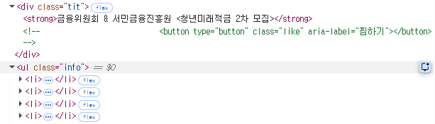
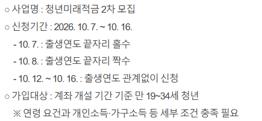
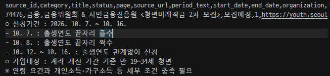
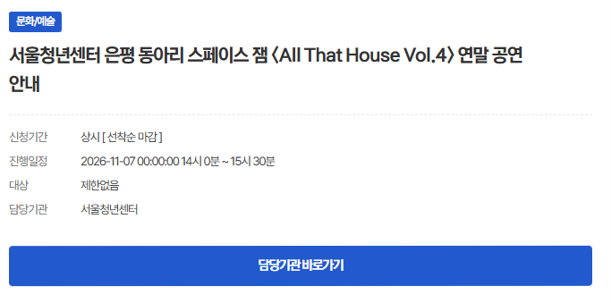

# 신청기간 분류 (period_type)

사이트 상세 페이지의 **신청기간** 항목의 원문을 `classify_period`(`backend/crawler/normalizer.py`)가 5종 중 하나로 분류해 DB 의 `period_type` 에 저장합니다. 마감일(`end_date`)과 시작일(`start_date`)은 이 분류에서만 만들어집니다.

## 원문은 어디에 있나

상세 페이지의 `ul.info` 목록에서 항목 이름(신청기간·진행일정·대상·담당기관)으로 값을 찾습니다. 순서에 기대지 않고 항목 이름으로만 찾습니다. 아래 이미지의 파란 영역이 `ul.info` 이고, 신청기간에 `2026-10-07 ~ 2026-10-16 00 : 00` 처럼 날짜와 시각이 함께 적혀 있습니다.

상세 페이지의 **본문**에는 신청기간이 다른 표기로 또 적혀 있는 경우가 있습니다(예: "2026. 10. 7. ~ 10. 16."). 이 본문 문장은 분류에 쓰지 않습니다. 본문은 앞 200자만 `summary` 로 저장합니다.

이미지 속 공고 내용의 출처는 청년몽땅정보통의 공개 페이지입니다.

## 5종 분류

판정 순서는 **dated → end_only → open → always → unknown** 입니다. 앞에서 맞는 것이 있으면 거기서 끝납니다.

| period_type | 조건 | start_date | end_date | 원문 예시 (코드 주석·테스트 기준) |
|---|---|---|---|---|
| `dated` | `YYYY-MM-DD ~ YYYY-MM-DD` 가 있음 | 있음 | 있음 | `2026-09-29 ~ 2026-10-09` (뒤에 `00 : 00` 같은 시각이 붙어도 됨) |
| `end_only` | 시작일 없이 `~ YYYY-MM-DD` 로 시작 | 없음 | 있음 | `~ 2026-10-08 00 : 00` |
| `open` | 마감일 미정: 시작일만 있고 `~` 뒤에 날짜가 없음, 또는 날짜 없이 `~` 바로 뒤에 시각이 옴 | 있으면 저장 | 없음 | `2026-09-20 ~ 00 : 00 [ 선착순 마감 ]`, `~ 00 : 00 [ 선착순 마감 ]` |
| `always` | 날짜가 없고 "상시"로 시작 | 없음 | 없음 | `상시 [ 선착순 마감 ]` |
| `unknown` | 위에 해당하지 않음 (경고 로그를 남김) | 없음 | 없음 | `~` 만 있음, `~ 추후 공지`, 빈 문자열 |

- 날짜가 달력에 없는 값(예: 2026-02-30)이면 `dated` 로 보지 않습니다. `end_only` 의 날짜가 유효하지 않으면 `unknown`, `open` 의 시작일이 유효하지 않아도 `unknown` 입니다.
- `open` 에서 `~` 뒤에 시각이 와야 "날짜 없는 open" 으로 봅니다. `~` 만 있거나 임의 문구가 오면 해석할 수 없으므로 `unknown` 으로 남깁니다.
- 상세를 받지 않은 행은 `period_type` 이 비어 있고(NULL), `unknown` 이 아닙니다.

신청기간이 "상시"인 상세 페이지의 모습입니다. 신청기간은 `상시 [ 선착순 마감 ]` 이고, 진행일정(행사 날짜)은 따로 적혀 있습니다.

## 진행일정은 마감일로 쓰지 않는다

상세 페이지에는 신청기간 외에 **진행일정**(행사 날짜)이 있고 여기에도 날짜가 들어 있습니다. 진행일정은 `schedule_text` 로 표시용으로만 저장하며, **어떤 유형에서도 마감일로 쓰지 않습니다**(쓰면 D-Day 가 틀어지기 때문). 시각은 무시하고 날짜만 쓰며 기준 시간대는 Asia/Seoul 입니다. 이 규칙은 테스트(`test_normalizer.py`, `test_record.py`)로 고정했습니다.

## DB 와 API 로 나가는 경로

| period_type | DB 에 저장 | 화면에 나오는 표시 (백엔드가 계산) |
|---|---|---|
| `dated` | `period_type`, `start_date`, `end_date` | 모집중(마감 D-Day), 시작일이 미래면 모집예정(시작 D-n), 마감일이 지났으면 목록에서 제외 |
| `end_only` | `period_type`, `end_date` | `dated` 와 같은 방식으로 마감 D-Day. 시작일이 없어 '시작 D-n' 은 만들 수 없음 |
| `open` | `period_type`, `start_date`(있으면) | '마감일 미정'. 시작일이 미래면 모집예정 |
| `always` | `period_type` | '상시'. 분야가 있으면 상시 탭, 없으면 기타 탭 |
| `unknown` | `period_type` | '확인 필요' |

`period_type` 값 자체를 응답 필드로 내보내는 것은 `/api/changes` 항목뿐입니다. 목록·달력·상세에는 `period_type` 필드가 없고, 대신 계산된 `display_status`·`group`·`d_day_label` 이 나갑니다([api_reference.md](api_reference.md)). D-Day 는 `backend/service/display.py` 의 `compute_display` 가 오늘 날짜와 비교해 계산하고, 화면은 그 결과만 표시합니다.

## 분류 규칙을 바꿀 때

`python -m backend.crawler.crawl --reclassify` 는 사이트에 접속하지 않고 DB 의 신청기간 원문(`period_text`)으로 `period_type`·`start_date`·`end_date` 를 다시 계산합니다. 변경 이벤트는 만들지 않습니다.
